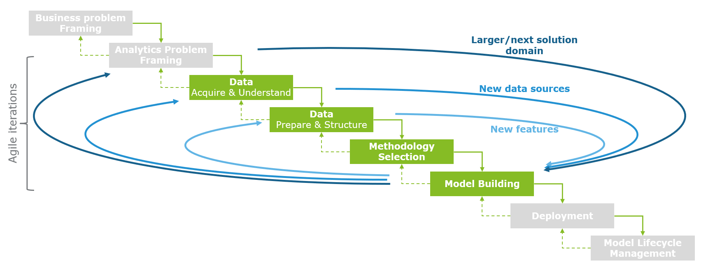

# Content

This readme contains the following sections

1. Introduction
2. How to start using it
3. Relative path usage
4. Folder structure
5. Workflow

## 1. Introduction

This folder structure is meant to provide your with a framework for structuring your modeling projects. 
This is a list of potential (not exhaustive) use cases:

* Forecasting
* Optimization
* Classification
* Outlier detection
* Time series analyses
* Clustering

## 2. How to start using it

Simple copy paste the following command in your terminal to create the folder stucture in your current director:
```
cookiecutter https://bitbucket.org/aimdeloittenl/mle_cookiecutter/src/main/
```

## 3. Relative path usage

To ease the adoption of your project code by someone else it is good practice to use a relative path as opposed to absolute paths.
Using relative paths ensures someone else does not have to hardcode his/her path in the various scripts. 

```
Absolute path: "C:/aimdeloittenl/mle_cookiecutter/src/main/{{cookiecutter.project_name}}/src/modelling/analysis.py"
relative path: "src/modelling/analysis.py"
```

## 4. Folder structure

The folder structure supports the AI methodology. More information about it can be found here:
The picture below depicts the necessary steps. The ones highlighted are included in the folder structure.




```


├── data                            Folder that contains all data                         
│   |
│   ├── bronze                      The original, immutable data dump. Can contain excel files for smaller projects
|   └── silver                      Data that is filtered and cleansed. Can contain excel files for smaller projects
|   └── gold                        The final, business-level aggregated, canonical data sets for modelling. Can contain excel files for smaller projects
|
├── EDA                             Folder to do exploratory data analysis
|
├── ETL                             Folder for ETL processes, maturing the data from bronze, to silver to gold. Can be done by analysts themselves in smaller projects (preprocessing)
|
├── modelling                       Folder to model data and save them
│   |                               
|   └── modeling_decisions.md       Place to reflect on hyperparameters, outliers, scope & technical limitations, model assumptions & sensitives and model explainability.
|
├── requirements.txt                The requirements file for reproducing the analysis environment. Generated with `pip freeze > requirements.txt`
|
├──.gitignore                       States explicitly which files GIT should ignore, such as the data and secret information
|
├── readme.md                       Introduces and explains the project   
|
├──.pre-commit-config.yaml          File to declare GIT hooks, automatically checking simple issues before submission to code review


``` 

## Workflow